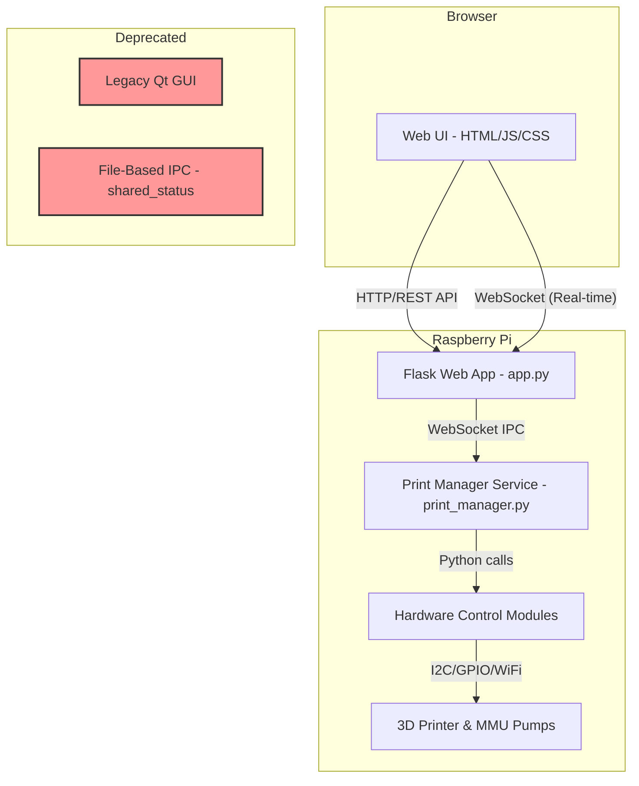

This file provides guidance to agents when working with code in this repository. **This file has been updated to reflect the project's migration from a legacy Qt application to a modern web-based architecture.**

## Project Mission

**Primary Goal:** Complete the migration to a stable, robust, web-based architecture. The immediate priority is to resolve the architectural conflicts between the new Flask web app and the backend Python controllers to create a functional end-to-end system.

**Claude's Role:** Act as a senior software architect and developer. Guide the implementation of a clean, service-oriented architecture using WebSockets for communication. Deprecate and remove legacy components, refactor existing modules for clarity and stability, and ensure the final system is user-friendly and reliable.

## Architecture Overview (Current & Target State)

The system is migrating from a legacy Qt architecture to a modern web service architecture. **All new development must follow the target architecture.**



### 1. Web Application (`web-app/`) - **PRIMARY INTERFACE**
- **Component:** Flask server (`app.py`) with SocketIO for real-time communication.
- **Role:** Serves the user interface (HTML/JS) and acts as a WebSocket broker. It accepts API calls from the browser and translates them into WebSocket commands for the backend service. **It does NOT perform any direct hardware control.**

### 2. Print Manager Service (`src/controller/print_manager.py`) - **THE BRAIN**
- **Component:** A persistent, long-running Python background service.
- **Role:** The sole authority for all hardware operations. It connects to the Flask WebSocket server as a client on startup. It listens for commands (e.g., 'start_print', 'run_pump'), executes the logic by calling other controller modules, and continuously emits status updates back to the web app.

### 3. Python Controller Modules (`src/controller/`)
- **`printer_comms.py`**: Handles low-level communication with the Anycubic printer.
- **`mmu_control.py`**: Manages the multi-material pump hardware.
- **`photonmmu_pump.py`**: Low-level stepper motor control.

### 4. Legacy Components (DEPRECATED)
- **Qt C++ GUI (`src/gui/`)**: No longer in active development. To be removed.
- **File-Based IPC (`shared_status/`)**: Replaced by `websocket_ipc.py`. To be removed.

## Quick Start (Target Architecture)

**The `print_manager` service and the `web-app` MUST be run as two separate, persistent processes.**

**1. Start the Print Manager Service (in one terminal):**
```bash
# Navigate to the controller directory
cd src/controller/

# Run the print manager. It will attempt to connect to the web app's WebSocket server.
python3 print_manager.py
```

**2. Start the Web Application (in a second terminal):**
```bash
# Navigate to the web-app directory
cd web-app/

# Install dependencies (if needed)
pip install -r requirements.txt

# Run the Flask server
python3 app.py
```
**Access the UI by opening a browser to `http://<raspberry-pi-ip>:5000`**

---

### Legacy GUI (DEPRECATED)
These commands are for reference only and should not be used for new development.
```bash
# Build Qt GUI application
cd src/gui
qmake ScionMMUController.pro
make

# Run the application
../../build/ScionMMUController
```

## Key Integration Points: The WebSocket Workflow

Communication is now exclusively handled by WebSockets, not file I/O or direct subprocess calls from the UI.

1.  **Command Flow (UI to Hardware):**
    *   User clicks a button in the Web UI (e.g., "Run Pump A").
    *   JavaScript in `app.js` makes a REST API call to Flask (`POST /api/pump`).
    *   The Flask endpoint in `app.py` validates the request and emits a structured WebSocket command: `socketio.emit('command', {'type': 'pump_control', ...})`.
    *   The `print_manager.py` service, which is listening for `'command'` events, receives the data.
    *   The `print_manager` calls the appropriate function (e.g., `mmu_control.run_pump(...)`).

2.  **Status Flow (Hardware to UI):**
    *   The `print_manager.py` service periodically polls the printer or executes a long-running task.
    *   After each action or status check, it emits a status update: `ipc_client.send_status_update('PRINTER', 'PRINTING', {'layer': 50})`.
    *   The Flask `app.py` server receives this event and broadcasts it to all connected web browser clients.
    *   JavaScript in `app.js` receives the `status_update` event and updates the HTML of the dashboard in real-time.

## Common Issues & Debugging (New Architecture)

**Web UI is not updating or commands have no effect:**
1.  **Is the `print_manager.py` service running?** Check the terminal where you started it. Are there any errors?
2.  **Is the `print_manager` connected to the web app?** The `app.py` terminal should log "Print manager registered and connected" when it connects.
3.  **Check browser developer console (F12):** Look for WebSocket connection errors or JavaScript errors.


**Testing Individual Components via API:**
Use `curl` from a terminal on the Pi (or another machine on the network) to test the web API, which in turn tests the full IPC loop.

```bash
# Test system status (should show printer state from print_manager)
curl http://localhost:5000/api/status

# Test running Pump A forward for 3 seconds
curl -X POST -H "Content-Type: application/json" \
  -d '{"motor": "A", "direction": "F", "duration": 3}' \
  http://localhost:5000/api/pump

# Test starting the multi-material print sequence
curl -X POST http://localhost:5000/api/multi-material/start
```

## Development Workflow

1.  **Remote Deployment & Testing (Raspberry Pi):**
    *   Commit and push changes via `git`.
    *   SSH into the Raspberry Pi: `ssh pidlp@10.10.36.109`.
    *   `cd` into the project directory and run `git pull`.
    *   Run the `print_manager.py` service and `app.py` web server.
    *   Perform full integration tests with the actual printer and MMU hardware.