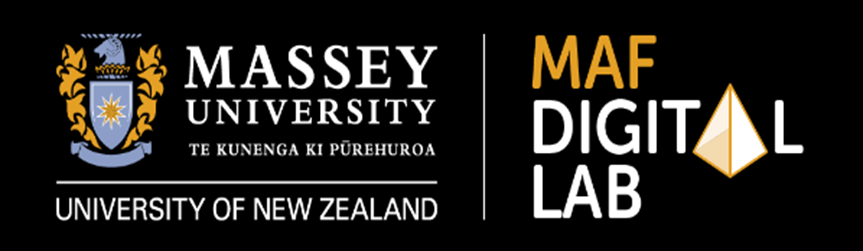

# Scion Research Multi-Material 3D Printer Controller

 

This project is a hardware and software solution designed to enable multi-material resin 3D printing on an Anycubic Photon Mono X 6k printer. It was developed as a collaborative project between [Scion](https://www.scionresearch.com/) and the [Massey AgriFood Digital Lab](https://www.massey.ac.nz/about-massey/our-structure/college-of-sciences/school-of-food-and-advanced-technology/agrifood-digital-lab/).

The system uses a single-board computer (like a Raspberry Pi) to act as an intermediary between the printer and a custom-built multi-material unit (MMU) consisting of stepper motor-driven pumps. It allows a user to define a print plan where different materials (resins) are automatically swapped at specific layer heights.

---

## Core Components

1.  **Control Unit:** A Raspberry Pi runs the control software, connects to the printer via Wi-Fi, and interfaces with the MMU hardware via GPIO pins.
2.  **Graphical User Interface (GUI):** A user-friendly desktop application built with C++/Qt. It serves as the central control panel for all printing and hardware operations.
3.  **Multi-Material Unit (MMU):** The physical hardware, composed of stepper motors and pumps, responsible for swapping the resins in the printer's vat.
4.  **Control Scripts:** A collection of Python scripts that handle the low-level logic, including:
    *   Communicating with the printer to get status, send commands (pause, resume, etc.).
    *   Controlling the MMU's stepper motors.
    *   Executing the automated multi-material print cycle.

---

## Capabilities

*   **Network Flexibility:** The control unit can operate in two modes:
    *   **Access Point (AP) Mode:** Creates its own Wi-Fi network, allowing direct connection to the printer without an existing network.
    *   **Wi-Fi Client Mode:** Connects to an existing Wi-Fi network.
*   **Full Printer Control:** The GUI provides standard printer controls, including listing files, starting a print, pausing, resuming, and stopping.
*   **Manual Hardware Control:** Manually operate individual MMU pumps to prime, purge, or test materials.
*   **Automated Multi-Material Printing:**
    *   Define a "recipe" of which material to use at specific layer numbers.
    *   Initiate a multi-material print process that automatically polls the printer's status.
    *   Pauses the print at the designated layer, runs the pumps to swap materials, and resumes printing seamlessly.
*   **Live Feedback:** A terminal-like output window in the GUI shows real-time status updates and command logs from the printer and control scripts.

---

## Project Structure

*   `/`: Contains shell scripts for managing network modes (`startAP.sh`, `stopAP.sh`).
*   `gui_mafdl/`: Source code for the main C++/Qt GUI application.
*   `build-untitled6-LinuxKit-Release/`: The default build output directory for the compiled GUI application.
*   `scripts/`: Contains all the core Python scripts for printer communication (`newmonox.py`, `pollphoton.py`) and hardware control (`photonmmu_pump.py`).
*   `gui/`: Contains experimental/alternative GUI files (GTK, Tkinter).

---

## Getting Started

### Prerequisites

*   A configured Raspberry Pi (or similar Linux SBC).
*   Python 3 and required libraries (`RPi.GPIO`, `adafruit-circuitpython-motorkit`).
*   Qt 5 development libraries.
*   The custom-built MMU hardware connected to the Raspberry Pi's GPIO pins.

### Build Instructions

1.  Navigate to the release build directory:
    ```bash
    cd build-untitled6-LinuxKit-Release/
    ```
2.  Run qmake to generate the Makefile from the project file:
    ```bash
    qmake ../gui_mafdl/untitled6.pro
    ```
3.  Compile the project:
    ```bash
    make
    ```
4.  The executable `untitled6` will be created in the current directory.

